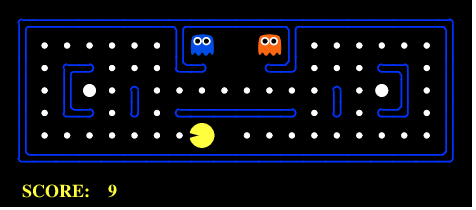
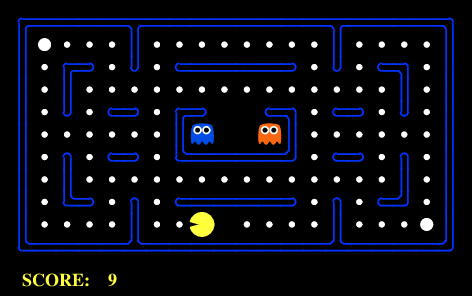

# Monte-Carlo-Tree-Search-ExMachina
**CSE 571: AI Team Project @ASU**
### Authors: Prabin Kumar Rath, Rahil Hastu, Sai Nikhil Guntur, and Austin Porter

This project presents an implementation of the [Monte-Carlo Tree Search (MCTS)](https://en.wikipedia.org/wiki/Monte_Carlo_tree_search) method customized for playing the Pacman game with random ghosts. We present an agent **Reflex-MCTS** that utilizes the effectiveness of MCTS for exploration and exploitation but switches to choosing customized reflex actions at critical zones. Throughout this report, we demonstrate that our agent yields consistent win and performance results as opposed to conventional tree-based methods, such as Minimax, Expectimax, and Alpha-Beta Pruning. We analyze different layouts where our agent succeeds and identify possible layouts where our agent performs sub-optimally.

<p align="center">
  
  
  
</p>

With successive iterations of MCTS, the agent should find actions most likely to end in a winning scenario. However, our implementation of the vanilla MCTS always lost in the Pacman world. After careful observation, we found that  for states where the agent is in close proximity to the ghosts, almost all of the random action rollouts lead to terminal states where the agent dies. Our rollout evaluation function assigns a fixed negative utility to losing terminal states; hence, by the innate property of the UCB1 function, all children of the root are assigned the same utility. There is no distinction between actions for the root node; thus, MCTS fails to determine the best action. For the remaining report, we use the alias *critical zone* for states where ghosts are nearby the agent.

After sufficient gameplays with vanilla MCTS, we found that our agent's priority at critical zones should be to run away from the ghosts as soon as possible. Given that we observe similar utilities for multiple actions, we override the final selection function to choose a reflex action from the set of actions with the highest utility. The successor state for this action has the highest sum of manhattan distance from active ghosts and hence helps the agent to escape critical zones. A few other strategies were utilized to obtain the best possible performance with our hybrid MCTS agent.

- **Rollout Evaluation**: Utility is initialized with the reciprocal of manhattan distance to the nearest food. It is scaled down by a multiplier proportional to the reciprocal of the layout’s perimeter. +1 and -1 are added to the utility for the win and lose states, respectively.
- **Thrashing Avoidance**: For non-critical zones, the set of actions with the highest utility is prioritized using the alignment of the action with the path to the nearest food, as generated by BFS search. As a result, reflex behavior is observed in huge layouts where MCTS returns similar utilities for all actions. This can be attributed to the fact that most rollouts are timed out for huge layouts. 
- **Stop Action Prevention**: For non-critical zones, it was observed that the agent tries to stop and wait for the ghosts to leave with an expectation that ghosts would randomly move away from the agent. This behavior is similar to the ones observed in conventional search algorithms such as Minimax, which results in severe thrashing until the ghosts corner the agent and kill it. To avoid such a scenario, stop actions are removed from the choices of actions available for the agent such that it never stops its pursuit of the next food. 

Our agent first seeks the best action using MCTS. It switches to reflex mode for states where multiple actions have similar high utilities. It must be noted that the MCTS algorithm dictates the agent’s choices for reflex actions. Interesting behaviors emerge when Reflex-MCTS assigns higher utilities to actions leading toward power pallets. We observed a peculiar and rather interesting behavior that the agent started exhibiting. Whenever it finds itself in a situation where it has to choose between a path containing power pallets and food on the other, it chooses the path containing the power pallet. Additionally, after eating a power pallet, if it finds a ghost nearby, it eats the ghost. This behaviors can be observed in the gameplay demonstrations shown at the beginning of this documentation. 

## Run Reflex-MCTS Agent
To run the agent, first change directory to the `2.multiagent/` folder
```
cd ./source/2.multiagent/
```
Run the agent using the following command
```bash
# Env: Python 3.10.5
# Small Layout
python ./pacman.py -p MonteCarloTreeSearchAgent -l smallClassic
# Medium Layout
python ./pacman.py -p MonteCarloTreeSearchAgent -l mediumClassic
# Large Layout
python ./pacman.py -p MonteCarloTreeSearchAgent -l originalClassic
```
## Run Tests

